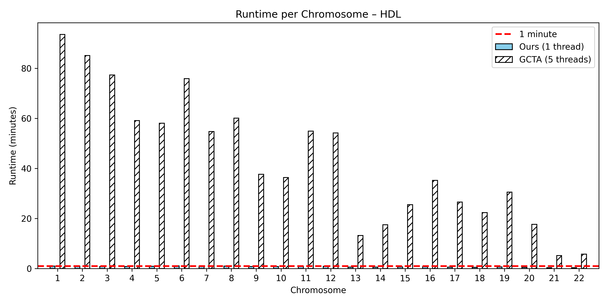

# Manc-COJO (Multi-ancestry Conditional and Joint Analysis)

**Manc-COJO** is a tool for multi-ancestry conditional and joint analysis (COJO) of GWAS summary statistics.
Note that our program can also perform single-ancestry COJO and reproduce the result of [original GCTA COJO](https://yanglab.westlake.edu.cn/software/gcta/#COJO), but runs much faster.

For example, for HDL trait on ~6,500,000 SNPs and ~76,000 individuals, the running time per chromosome for our program using 1 thread, and GCTA using 5 threads, is as follows. 


In terms of memory usage, you can approximate the memory footprint using the formula **MN / 4000** GB, where M is the number of SNPs (in thousands) and N is the number of individuals (in thousands) in the `.bed` file. In our study, the largest case involves ~500 k SNPs and ~76 k individuals on chromosome 2, corresponding to 500 × 76 / 4000 ≈ 9.5 GB of memory.

## Installation

You can clone this repo or directly download the executable `manc_cojo` for immediate use on 64-bit Intel Linux.  
If it doesn’t run immediately, make sure it has execution permission:

```bash
chmod +x manc_cojo
```
You may also build the program by yourself by following [the steps below](#Building-from-Source) (which is quite simple).

### Verify Installation

After building or downloading the executable, you can confirm that it runs correctly by checking its usage information:

```bash
./manc_cojo --help
```

If the program is installed properly, it will print the list of available options and a brief description of each.

Our program mainly targets **Linux** servers, but we also include ready-to-use executables for **macOS** and **Windows** in the `bin_macOS_win` folder. They were compiled and tested on macOS 15.3.2 and Windows 11.

If you run into compatibility issues on any system, feel free to reach out and we are very happy to help.

---
## Usage & Example Commands

The usage is largely consistent with the original GCTA COJO, while extended to handle **multiple cohorts** and **PLINK LD matrix inputs**,
Specifically,
1. We extend `--bfile` `--cojo-file` `--keep` `--remove` to multiple cohorts. 
  Please ensure that paths are correctly paired across cohorts.
2. We support PLINK LD matrix inputs through the option `--ld` (as an alternative to ``--bfile``).
- For using genotype data `--bfile`, please provide `.bed` `.bim` `.fam` files.
- For using LD matrix `--ld`, please provide `.bim` `.ld` files. 
  To filter out SNPs with large MAF differences, please provide `.frq` files as well.

Nevertheless, there are some minor differences:
1. The program does **not** output `.cma.cojo` and `.ldr.cojo` by default, as they can be very large. If you need all possible outputs, use `--output-all`. This behavior may change in future releases depending on user feedback.
2. In `--cojo-joint` mode, users are required to specify `--extract` to avoid accidentally including all SNPs.
3. Three algorithms are available for both stepwise selection (`--slct-mode`) and effect size estimation (`--effect-size-mode`):
`GCTA`, `imputeNA`, and `removeNA`. In both cases, the default option is `GCTA` (original GCTA model). 
  Please refer to our paper for detailed algorithm descriptions.


For example, to reproduce the **same results** as the original GCTA-COJO for a single cohort, simply replace the path to the GCTA executable with ours:

```bash
./manc_cojo
--bfile LD_ref_path \
--cojo-file GWAS_sumstat_path \
--out Output_directory_and_name \
--cojo-slct
```

If you prefer to use PLINK LD matrix inputs, replace `--bfile` with `--ld`:

```bash
./manc_cojo
--ld LD_ref_path \
--cojo-file GWAS_sumstat_path \
--out Output_directory_and_name \
--cojo-slct
```

For multiple cohorts, if you want to remove genotype NAs when calculating SNP correlations, use:

```bash
./manc_cojo
--bfile LD_ref_path1 LD_ref_path2 ... LD_ref_pathN \
--cojo-file GWAS_sumstat_path1 GWAS_sumstat_path2 ... GWAS_sumstat_pathN \
--out Output_directory_and_name \
--cojo-slct \
--slct-mode removeNA
```

For calculating joint effects of given SNPs on a single cohort using original GCTA-COJO model:

```bash
./manc_cojo \
--bfile myfolder/LD_ref
--cojofile myfolder/sumstat \
--out output_path/output_filename \
--diff-freq 1 \
--cojo-collinear 0.99 \
--extract given_SNP_path \
--cojo-joint
```

(`--cojo-collinear 0.99` and `--diff-freq 1` for including all given SNPs)

---
## Supported Command-line Options

### Input Data Format Options (exactly one required)

| Option      | Description                                                        |
| ----------- | ------------------------------------------------------------------ |
| `--bfile`   | PLINK binary file prefix for each cohort [`.bim` `.bed` `.fam`]    |
| `--ld`      | PLINK LD file prefix for each cohort [`.bim` `.ld` `(.frq)`]       |

### Main Settings 

| Program mode    | Type     | Description (exactly one of these three is required)          |
| --------------- | -------- | ------------------------------------------------------------- |
| `--cojo-slct`   | *flag*   | Stepwise iterative selection of independently associated SNPs |
| `--cojo-joint`  | *flag*   | Calculate joint effects for provided SNPs and exit<br> Must be used with `--extract`|
| `--cojo-cond`   | *option* | Calculate conditional effects for provided SNPs and exit<br> Must provide a file with a list of SNPs |


| Algorithm option | Allowed Values | Default | Description |
| ------- | --------------- | -------- | ------------ |
| `--slct-mode` | `GCTA`, `removeNA`, `imputeNA` | `GCTA` | Iterative SNP selection method |
| `--effect-size-mode` | `GCTA`, `removeNA`, `imputeNA` | `GCTA` | Effect size estimation method |

### Original GCTA Options

These options and flags are functionally identical to those in the original GCTA. You can find more detailed definitions at [https://yanglab.westlake.edu.cn/software/gcta](https://yanglab.westlake.edu.cn/software/gcta).

| Option         | Description                                                    | Default          |
| ------------------ | -------------------------------------------------------------- | ---------------- |
| `--cojo-file`      | GWAS summary statistics file for each cohort                   | `Required`       |
| `--out`            | Output file path prefix                                        | `Required`       |
| `--cojo-wind`      | SNP position window in Kb (`-1` disables windowing)            | `10000` (±1e7)   |
| `--cojo-p`         | Significance threshold for SNP selection                       | `5e-8`           |
| `--cojo-collinear` | Colinearity threshold for SNP inclusion (`0–0.999`)            | `0.9`            |
| `--diff-freq`      | Frequency diff threshold between sumstat and PLINK (`0-1`)     | `0.2`            |
| `--maf`            | Minor allele frequency threshold (`1e-5-0.5`)                  | `0.01`           |
| `--geno`           | Missingness threshold (`0-1`)                                  | `1` (none)       |
| `--extract`        | File path of SNPs to be included                               |                  |
| `--exclude`        | File path of SNPs to be excluded                               |                  |
| `--keep`           | File path of individuals to be included                        |                  |
| `--remove`         | File path of individuals to be excluded                        |                  |

### Multi-ancestry COJO Options/Flags

| Option         | Description                                                       | Default             |
| ------------ | ----------------------------------------------------------------- | ------------------- |
| `--fixed`    | File path for fixed candidate SNPs (non-removable in selection)   |                     |
| `--R2`       | R² threshold for forward selection                                | `-1` (none)         |
| `--R2back`   | R² threshold for backward selection                               | `-1` (none)         |
| `--iter`           | Maximum number of iterations                                   | `10000`       |
| `--thread-num`     | Number of thread to use (One thread is actually fast enough)   | `1`           |

| Flag         | Description                                                       |
| ------------ | ----------------------------------------------------------------- |
| `--freq-mode-and`  | Only keep SNPs that reach MAF threshold in sumstat of all cohorts<br>By default, keep SNPs that reach threshold in at least one cohort |
| `--MDISA`    | Run single-ancestry analysis after multi-ancestry COJO<br> By default, only run COJO selection on multiple cohorts and exit |
| `--output-all`     | Save all .cma.cojo, .jma.cojo and .ldr.cojo results to file    |

---

## Building from Source

If you’d like the fastest performance or plan to modify the code, please clone the repository and build it yourself from the command line. Below are simple example commands for **Linux** and **macOS**.

> **Requirements**
> - A C++11-compatible compiler (`GCC ≥ 4.8.1` or `Clang ≥ 3.3`)
> - Optional: OpenMP for multithreading (default on Linux; not included with Apple Clang)

### Linux

```bash
git clone https://github.com/light156/multi-ancestry-COJO.git
cd multi-ancestry-COJO

g++ -std=c++11 -O3 -march=native -DNDEBUG -fopenmp -pthread \
    -I data -I include -I include/Eigen \
    data/Geno.cpp src/*.cpp -o manc_cojo
```

### macOS
macOS’s default compiler (Apple Clang) does not include OpenMP support. Although you can install LLVM via Homebrew for full OpenMP functionality, using one thread is already fast enough as shown above.
So it is fine to just build a single-threaded version for simplicity:

```bash
git clone https://github.com/light156/multi-ancestry-COJO.git
cd multi-ancestry-COJO

clang++ -std=c++11 -O3 -march=native -DNDEBUG \
    -I data -I include -I include/Eigen \
    data/Geno.cpp src/*.cpp -o manc_cojo
```

### Windows
Since large computing clusters primarily run on Linux, we do not specifically target Windows.
However, if there is a real need to run on Windows, you can install [mingw-w64](https://www.msys2.org/) by following the official guide.
After successful installation, you can compile the source code with GCC using the same commands as on Linux to obtain the executable file.

> Precompiled binaries for Linux, macOS, and Windows are all available in our GitHub repository.

---
## License and Acknowledgments

This project is released under the **MIT License** (see the `LICENSE` file for details).  

It includes or depends on the following third-party open-source libraries:

- **[Eigen 3.4.1](https://eigen.tuxfamily.org)** – Used for all matrix computations (`external/Eigen`)

- **[CLI11](https://github.com/CLIUtils/CLI11)** – Modified for parsing command-line options (`external/CLI11.hpp`)

---

Please contact Yong (yong.wang@stats.ox.ac.uk) for software-related enquries and bug reports, or Mark (xiaotong.wang@psych.ox.ac.uk) for algorithm-related questions. We also welcome GitHub issues so that discussions are visible to all users.
