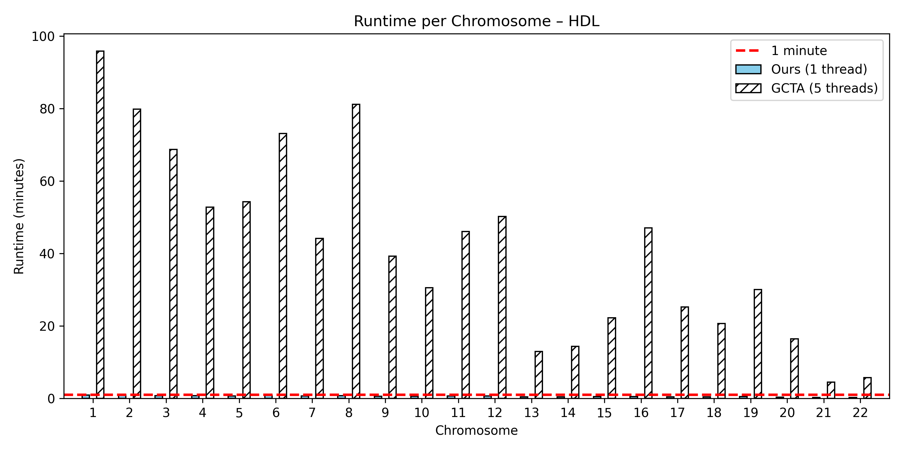

# Manc-COJO (Multi-ancestry Conditional and Joint Analysis)

**Manc-COJO** is a tool for multi-ancestry conditional and joint analysis (COJO) of GWAS summary statistics.
Note that our program can also perform single-ancestry COJO and reproduce the result of [original GCTA COJO](https://yanglab.westlake.edu.cn/software/gcta/#COJO), but runs much faster.

For example, for HDL trait on ~6,500,000 SNPs and ~76,000 individuals, the running time per chromosome for our program using 1 thread, and GCTA using 5 threads, is as follows. 


In terms of memory usage, you can approximate the memory footprint using the formula **MN / 4000** GB, where M is the number of SNPs (in thousands) and N is the number of individuals (in thousands) in the `.bed` file. In our study, the largest case involves ~500 k SNPs and ~76 k individuals on chromosome 2, corresponding to 500 × 76 / 4000 ≈ 9.5 GB of memory.

## Installation

### [Download link (64-bit Linux systems)](https://github.com/light156/multi-ancestry-COJO/releases/download/v1.0.0/manc_cojo)

Directly download the executable `manc_cojo` by clicking the above link, and it is ready to run as it is.
Make sure it has execution permission by running

```bash
chmod +x manc_cojo
```

You can confirm by checking its usage information, which prints the available options and a brief description of each, by running:

```bash
./manc_cojo --help
```

Our program mainly targets **Linux** servers, but we also include ready-to-use executables for **macOS** and **Windows** in the `bin_macOS_win` folder. They were compiled and tested on macOS 15.3.2 and Windows 11.

If you run into compatibility issues on any system, feel free to reach out and we are very happy to help.

---
## Usage

The usage is largely consistent with the original GCTA COJO, while extended to handle **multiple cohorts** and **PLINK LD matrix inputs**.

For COJO analysis on a single cohort (**same as original GCTA-COJO**), simply replace the path to the GCTA executable with ours:

```bash
./manc_cojo --bfile path --cojo-file GWAS_sumstat_path --out Output_path_name --cojo-slct
```

For COJO analysis on multiple cohorts, just append the bfile and sumstat file paths and make sure they are paired:

```bash
./manc_cojo \
--bfile path1 path2 ... pathN \
--cojo-file GWAS_sumstat_path1 GWAS_sumstat_path2 ... GWAS_sumstat_pathN \
--out Output_path_name \
--cojo-slct 
```

---
## License and Acknowledgments

This project is released under the **MIT License** (see the `LICENSE` file for details).  

It includes or depends on the following third-party open-source libraries:
- **[Eigen 3.4.1](https://eigen.tuxfamily.org)** – Used for all matrix computations (`external/Eigen`)
- **[CLI11](https://github.com/CLIUtils/CLI11)** – Modified for parsing command-line options (`external/CLI11.hpp`)
- **[fastfloat](https://github.com/fastfloat/fast_float)** - Used for number parsing (`external/fast_float.h`)

---

Please contact Yong (yong.wang@stats.ox.ac.uk) for software-related enquries and bug reports, or Mark (xiaotong.wang@psych.ox.ac.uk) for algorithm-related questions. We also welcome GitHub issues, including usage feedback and new feature requests, so that discussions are visible to all users.
